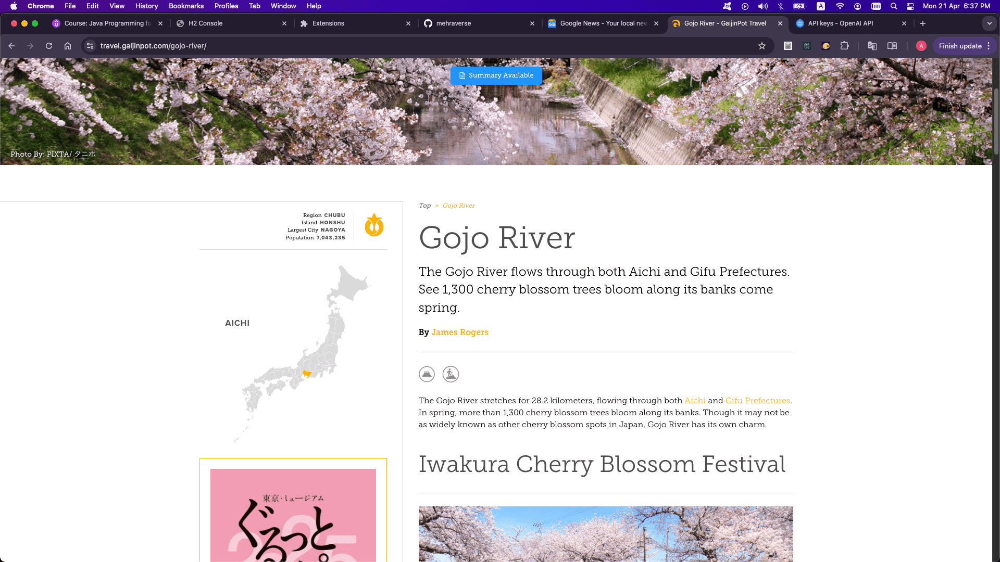
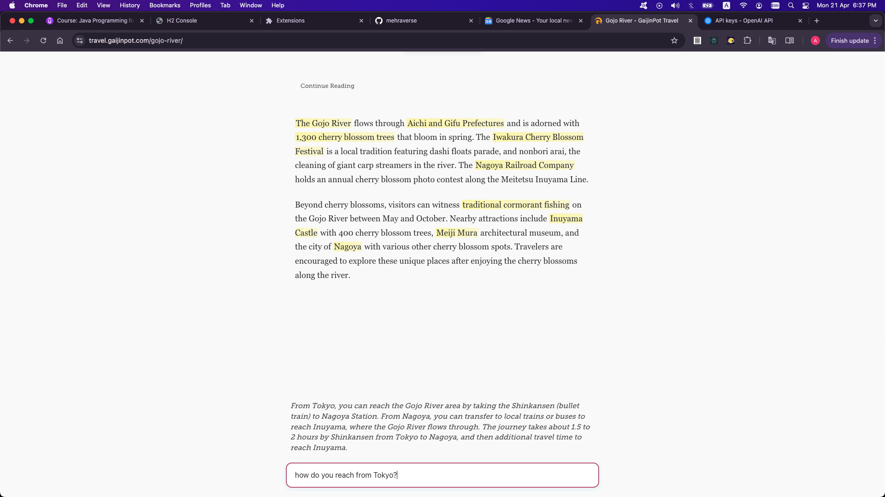

# Quick Summarizer Chrome Extension

Smart AI-powered Chrome extension that summarizes web articles and selected text.

## Features

- 🔔 "Summary Available" notification for compatible pages
- 💨 Instant page summarization via icon click or Cmd/Ctrl + Shift + K
- 🔍 Quick summaries for selected text via right-click menu
- 💬 Interactive Q&A about the article content
- ⚡️ Smart caching for faster performance

## Setup

1. Clone repo and run `npm install` in summarizer-proxy-server
2. Add OpenAI API key to `.env` file: OPENAI_API_KEY="your_key_here"
3. Start server: `npm start`
4. Load extension in Chrome from chrome://extensions (Developer mode)

## Usage

- Click "Summary Available" to see summary on compatible pages
- Select text and right-click to summarize selection
- Use Cmd/Ctrl + Shift + K shortcut to toggle summary page
- Ask questions about the article in chat interface

## Tech Stack

Chrome Extension (Manifest V3), Node.js/Express, OpenAI GPT API, Mozilla Readability

## Screenshots

-Indication that Summary Mode is available

- Summary Mode
  

## License

MIT
